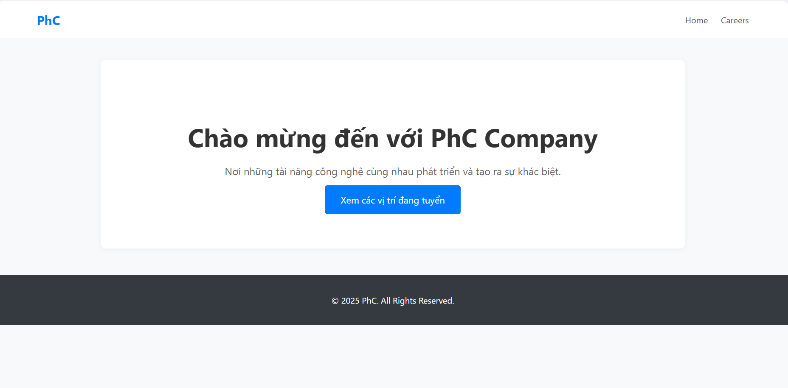
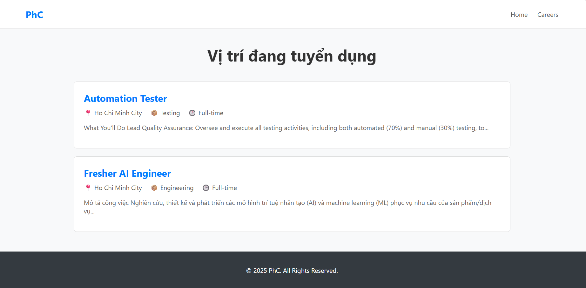
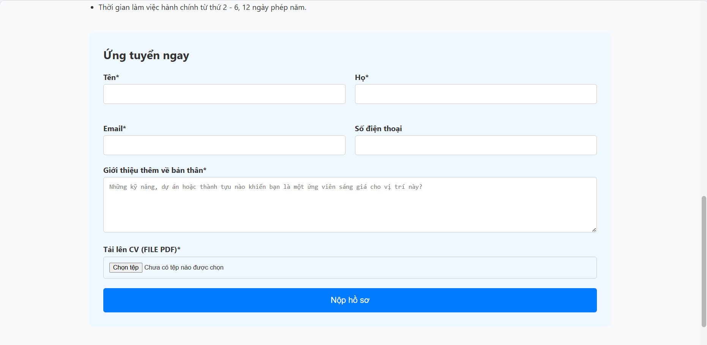
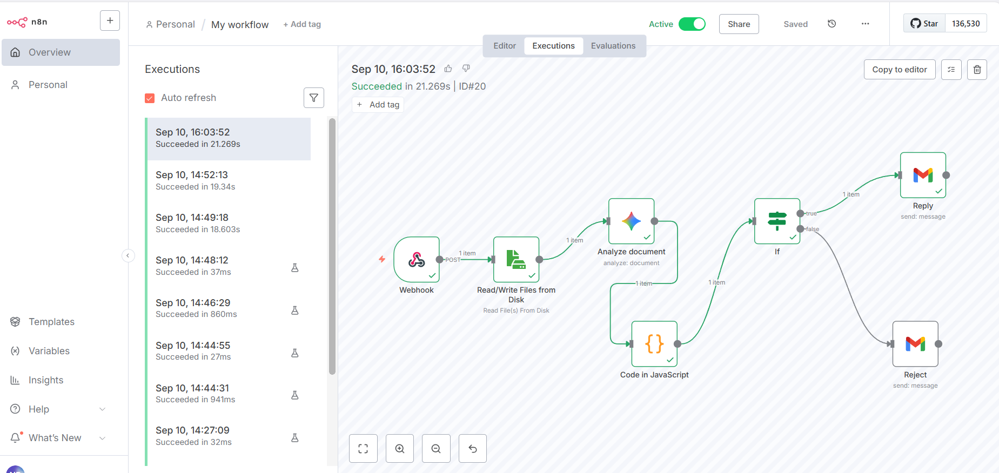
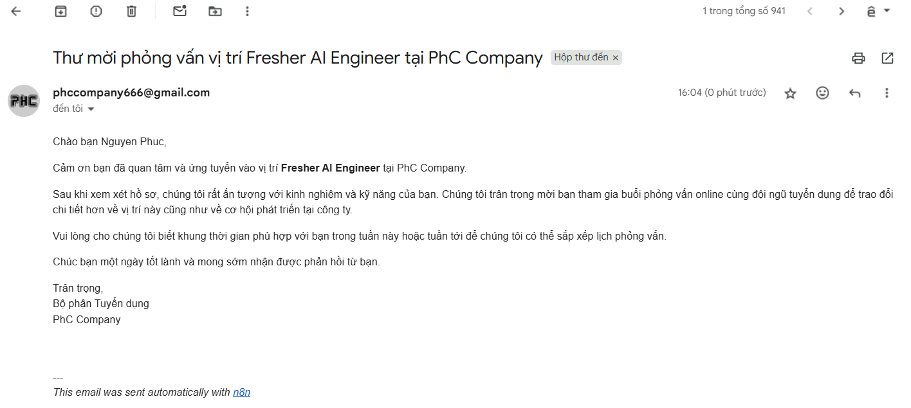

# Hệ thống Sàng lọc CV Tự động

Đây là một dự án full-stack xây dựng một hệ thống tuyển dụng nội bộ hoàn
chỉnh, tích hợp trí tuệ nhân tạo để tự động hóa quy trình sàng lọc hồ sơ
ứng viên.

## 🚀 Tính năng chính

### Website Tuyển dụng (Flask)

- **Admin Panel**: Giao diện quản trị được bảo vệ bằng mật khẩu để
  Thêm, Sửa, Xóa các tin tuyển dụng.\
- **Trang Tuyển dụng công khai**: Hiển thị danh sách các công việc
  đang hoạt động cho ứng viên.\
- **Form ứng tuyển**: Cho phép ứng viên điền thông tin và nộp CV (chỉ
  định dạng PDF).

### Luồng xử lý tự động (n8n & AI)

- **Tiếp nhận tự động**: Ngay khi có CV được nộp, hệ thống tự động
  kích hoạt.\
- **Phân tích bằng AI**: Sử dụng Google Gemini API để đọc nội dung CV,
  so sánh với mô tả công việc (JD) và chấm điểm mức độ phù hợp.\
- **Tự động phản hồi**:
  - Điểm cao → Gửi thư mời phỏng vấn.\
  - Điểm thấp → Gửi thư từ chối lịch sự.

## 🛠️ Công nghệ sử dụng

- **Backend**: Python, Flask, SQLAlchemy\
- **Frontend**: HTML, CSS\
- **Automation**: n8n\
- **AI**: Google Gemini API\
- **Deployment (Local)**: Docker, Docker Desktop

## ⚙️ Hướng dẫn cài đặt và chạy tại local

### Yêu cầu

- Python 3.8+\
- Docker và Docker Desktop đã được cài đặt và đang chạy.\
- API Key từ Google AI Studio.

### Các bước thực hiện

#### 1. Clone repository:

```bash
git clone <URL_repository_cua_ban>
cd <ten_repository>
```

#### 2. Cài đặt Backend (Flask):

```bash
# Tạo và kích hoạt môi trường ảo
python -m venv venv
# Windows: venv\Scripts\activate
# macOS/Linux: source venv/bin/activate

# Cài đặt các thư viện cần thiết
pip install -r requirements.txt
```

##### Tạo tài khoản admin lần đầu tiên:

```python
from app import app, db, Admin
app.app_context().push()
db.create_all()
if not Admin.query.filter_by(username='admin').first():
    admin_user = Admin(username='admin')
    admin_user.set_password('your_password') # Thay mật khẩu của bạn
    db.session.add(admin_user)
    db.session.commit()
exit()
```

#### 3. Khởi động n8n bằng Docker:

Trong thư mục dự án, tạo một thư mục con tên là **n8n-data**.

Mở Terminal và chạy lệnh sau (thay thế `/path/to/your/project` bằng
đường dẫn tuyệt đối đến thư mục dự án của bạn):

```bash
docker run -it --name n8n -p 5678:5678 -v "/path/to/your/project/uploads:/files" -v "/path/to/your/project/n8n-data:/home/node/.n8n" n8nio/n8n
```

#### 4. Cấu hình n8n:

- Truy cập <http://localhost:5678>.\
- Nhấn **Import from File** và chọn file `workflow.json` có trong dự
  án.\
- Mở các node Google Gemini và Gmail, tạo lại **Credentials** (dán API
  key, kết nối lại tài khoản Gmail).\
- Mở node Webhook, copy **Production URL**.

#### 5. Chạy ứng dụng Flask:

- Mở một Terminal mới, di chuyển vào thư mục dự án và kích hoạt
  `venv`.\
- Mở file `app.py`, tìm đến dòng `webhook_url` và dán **Production
  URL** của n8n vào.

Chạy server:

```bash
python app.py
```

#### 6. Sử dụng hệ thống:

- Truy cập <http://127.0.0.1:5000/login> để vào trang Admin.\
- Truy cập <http://127.0.0.1:5000/careers> để xem trang tuyển dụng của
  ứng viên.

### 7. Một số hình ảnh:






